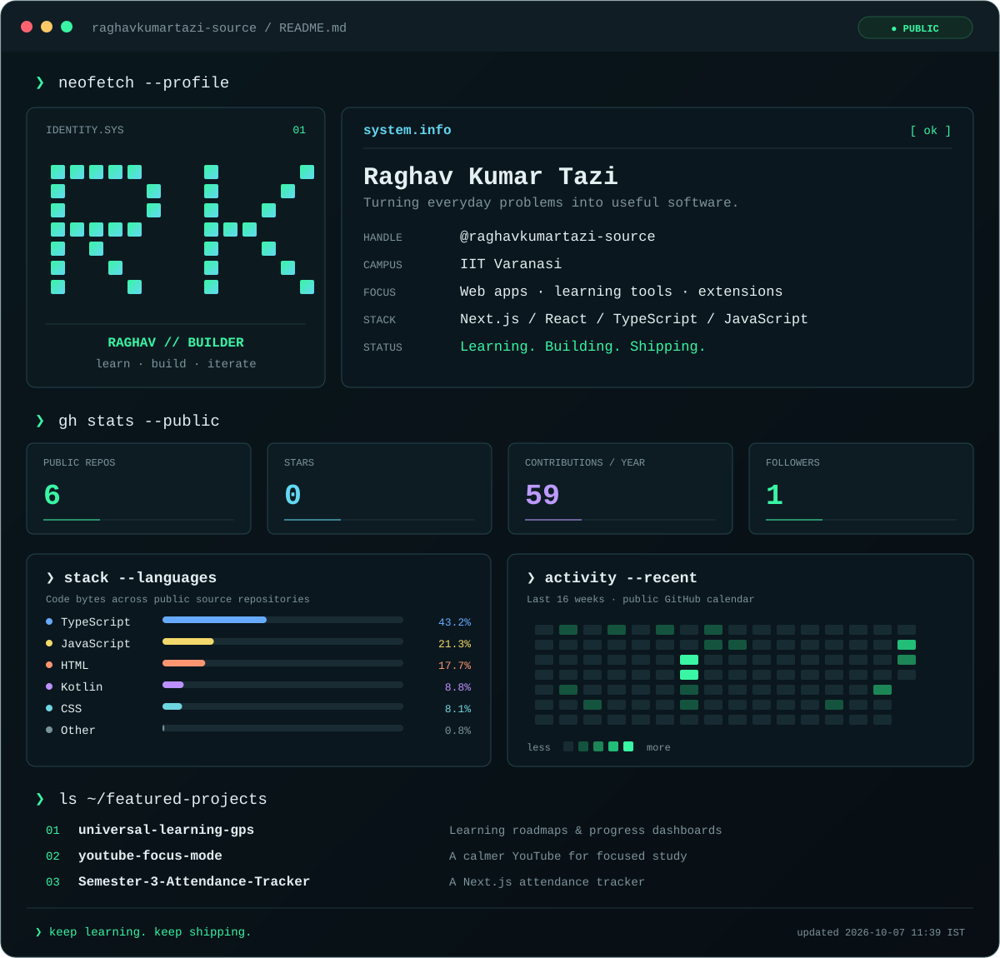

  

### `❯ open ~/featured-projects`

| Project | What I'm building | Stack |
| :--- | :--- | :--- |
| [**Universal Learning GPS ↗**](https://github.com/raghavkumartazi-source/universal-learning-gps) | Learning roadmaps, skill-gap analysis, and progress dashboards. | Next.js · React · TypeScript |
| [**YouTube Focus Mode ↗**](https://github.com/raghavkumartazi-source/youtube-focus-mode) | A browser extension for distraction-free study, focus sessions, and streaks. | JavaScript · Chrome Extension |
| [**Semester 3 Attendance Tracker ↗**](https://github.com/raghavkumartazi-source/Semester-3-Attendance-Tracker) | A web app for tracking semester attendance. | Next.js · TypeScript |

<code>❯ cat about.txt</code>

Hi, I'm **Raghav Kumar Tazi** — from **IIT Varanasi**. I build web apps, learning tools, and browser extensions that make everyday tasks a little easier.

I enjoy turning an idea into something usable, then improving it one iteration at a time.

[Explore my repositories](https://github.com/raghavkumartazi-source?tab=repositories) · [Say hello](https://github.com/raghavkumartazi-source/raghavkumartazi-source/issues/new)

Stats refresh daily from public GitHub data. Languages reflect code bytes in public, non-fork project repositories. The contribution card uses GitHub's public calendar for the last year. [Customize this terminal](./SETUP.md).
